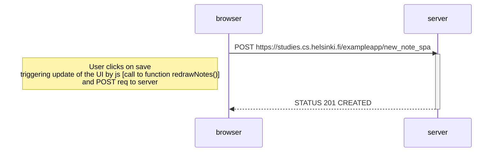

```mermaid
sequenceDiagram
    participant browser
    participant server

    browser->>server: POST https://studies.cs.helsinki.fi/exampleapp/new_note_spa
    activate server
    Note left of browser: User clicks on save <br/> triggering update of the UI by js [call to function redrawNotes()] <br/> and POST req to server
    server-->>browser: STATUS 201 CREATED
    deactivate server

```
